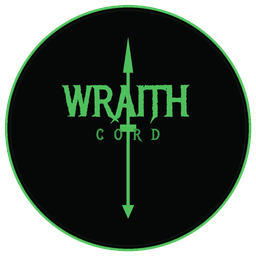

# [](https://github.com/kelcum/Deadbolt) Deadbolt

[](https://github.com/kelcum/Deadbolt/actions/workflows/test.yml)

Deadbolt is a personal fork of [Equicord](https://github.com/Equicord/Equicord) (itself a fork of [Vencord](https://github.com/Vendicated/Vencord)), focused on quality-of-life plugins.

### Included Plugins

Deadbolt ships with the same 300+ plugin library Equicord maintains, plus whatever gets added here going forward. Browse Equicord's plugin list [here](https://equicord.org/plugins) for what's included by default.

## Installing / Uninstalling

There's no packaged installer for Deadbolt — Equicord's official installer (Equilotl) only targets the upstream Equicord repo, not this fork. Build and inject it from source instead; see below.

## Building from source

### Dependencies

[Git](https://git-scm.com/download) and [Node.JS LTS](https://nodejs.dev/en/) are required.

Install `pnpm`:

> :exclamation: This next command may need to be run as admin/root depending on your system, and you may need to close and reopen your terminal for pnpm to be in your PATH.

```shell
npm i -g pnpm
```

> :exclamation: **IMPORTANT** Make sure you aren't using an admin/root terminal from here onwards. It **will** mess up your Discord/Deadbolt instance and you **will** most likely have to reinstall.

Clone Deadbolt:

```shell
git clone https://github.com/kelcum/Deadbolt
cd Deadbolt
```

Install dependencies:

```shell
pnpm install --frozen-lockfile
```

Build Deadbolt:

```shell
pnpm build
```

Inject Deadbolt into your desktop client:

```shell
pnpm inject
```

Build Deadbolt for web:

```shell
pnpm buildWeb
```

After building Deadbolt's web extension, locate the appropriate ZIP file in the `dist` directory and follow your browser’s guide for installing custom extensions, if supported.

Note: Firefox extension zip requires Firefox for developers

## Windows: reapplying branding after a Canary update

Discord Canary's own updater prunes old install folders and resets a few
OS-level files (its icon, the boot splash image, Start Menu shortcuts) on
every update — none of that is part of Deadbolt itself, so it silently
reverts. It can also occasionally leave the injection stub in a broken
state, which shows up as a "Cannot find module ...patcher.js" crash on
launch.

If that happens, rebuild and reapply:

```shell
pnpm install
pnpm build
powershell -ExecutionPolicy Bypass -File scripts\reapply-branding.ps1 -Restart
```

`-Restart` relaunches Discord Canary only; Stable is never touched.

## Credits

Deadbolt is built on [Equicord](https://github.com/Equicord/Equicord) and its 300+ plugin library — thank you to Equicord's contributors, to [Vendicated](https://github.com/Vendicated) for creating [Vencord](https://github.com/Vendicated/Vencord), and to [Suncord](https://github.com/verticalsync/Suncord) by [verticalsync](https://github.com/verticalsync).

## Disclaimer

Discord is trademark of Discord Inc., and solely mentioned for the sake of descriptivity.
Mentioning it does not imply any affiliation with or endorsement by Discord Inc.
Deadbolt is not connected to Vencord or Equicord.

<details>
<summary>Using Deadbolt violates Discord's terms of service</summary>

Client modifications are against Discord’s Terms of Service.

However, Discord is pretty indifferent about them and there are no known cases of users getting banned for using client mods! So you should generally be fine if you don’t use plugins that implement abusive behaviour. But no worries, all inbuilt plugins are safe to use!

Regardless, if your account is essential to you and getting disabled would be a disaster for you, you should probably not use any client mods (not exclusive to Deadbolt), just to be safe.

Additionally, make sure not to post screenshots with Deadbolt in a server where you might get banned for it.

</details>
